# Automating Nexus Deployment with Ansible

## Introduction

Instead of creating a cloud server, SSH'ing into it to download Nexus binaries, unpack and eventually run Nexus, I will be automating this processes with Ansible.

## Installation

I will write the first two playbooks. One for installing java and net tools and the other for downloading Nexus binaries, then run it.

```yaml
---
- name: Install java and net-tools
  hosts: 178.62.13.23
  tasks:
    - name: Update repo and cache
      apt: update_cache=yes force_apt_get=yes cache_valid_time=3600
    - name: Install Java 8
      apt: name=openjdk-8-jre-headless
    - name: Install net-tools
      apt: name=net-tools

- name: Download and unpack Nexus installer
  hosts: 178.62.13.23
  tasks:
    - name: Download Nexus
      get_url:
        url: https://download.sonatype.com/nexus/3/latest-unix.tar.gz
        dest: /opt/
```

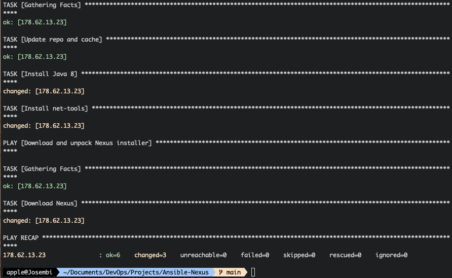

</hr>

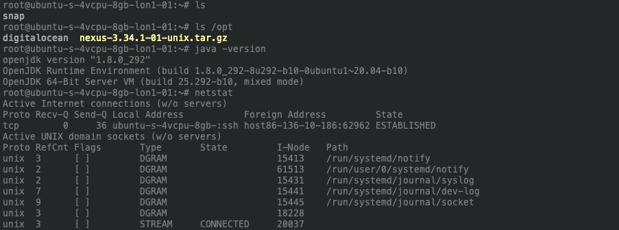

Next step is to untar the downloaded nexus archive.

```yaml
    - name: Untar Nexus installer
      unarchive:
        src: /opt/nexus-3.34.1-01-unix.tar.gz
        dest: /opt/
        remote_src: yes
```

Because there are multiple versions of binaries to download and you never know which one you have till you SSH in the machine, you could actually configure the playbook so that the terminal will throw a "debug" message of a JSON with metadata of what you are getting.

```yaml
---
- name: Install java and net-tools
  hosts: 178.62.13.23
  tasks:
    - name: Update repo and cache
      apt: update_cache=yes force_apt_get=yes cache_valid_time=3600
    - name: Install Java 8
      apt: name=openjdk-8-jre-headless
    - name: Install net-tools
      apt: name=net-tools

- name: Download and unpack Nexus installer
  hosts: 178.62.13.23
  tasks:
    - name: Download Nexus
      get_url:
        url: https://download.sonatype.com/nexus/3/latest-unix.tar.gz
        dest: /opt/
      register: download_result
    - debug: msg={{download_result}}
#    - name: Untar Nexus installer
#      unarchive:
#        src: /opt/nexus-3.34.1-01-unix.tar.gz
#        dest: /opt/
#        remote_src: yes
```

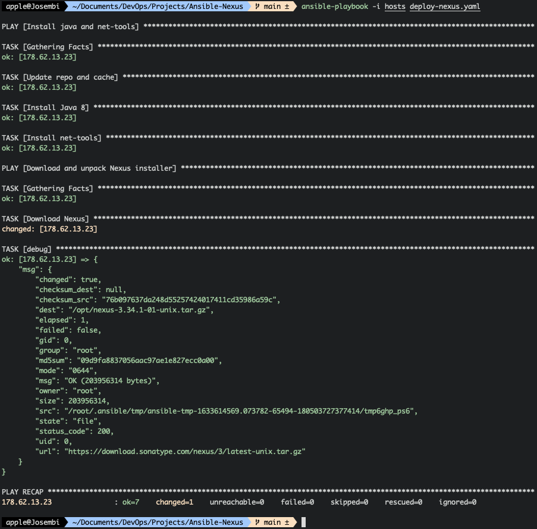

It's always good to know what you are installing, especially versions as they usually come in handy. Next I'll run the installation again without the debugger and see what is happening. Below is the second play.

```yaml
- name: Download and unpack Nexus installer
  hosts: 178.62.13.23
  tasks:
    - name: Download Nexus
      get_url:
        url: https://download.sonatype.com/nexus/3/latest-unix.tar.gz
        dest: /opt/
      register: download_result
    - name: Untar Nexus installer
      unarchive:
        src: "{{download_result.dest}}"
        dest: /opt/
        remote_src: yes
```

Both download and unpacking was successful.

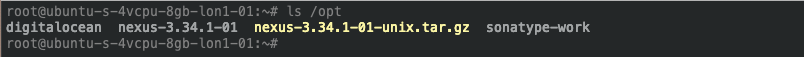

If I want to debug and view the contents of the nexus folder (/opt/nexus-3.34.1-01) as an output then I can add the following;

```yaml
    - name: Find Nexus Folder
      find:
        paths: /opt/
        pattern: "nexus-*"
        file_type: directory
      register: find_result
    - debug: msg={{find_result}}
 #   - name: Rename nexus folder
 #     shell: mv {{find_result.files[0].path}} /opt/nexus
```

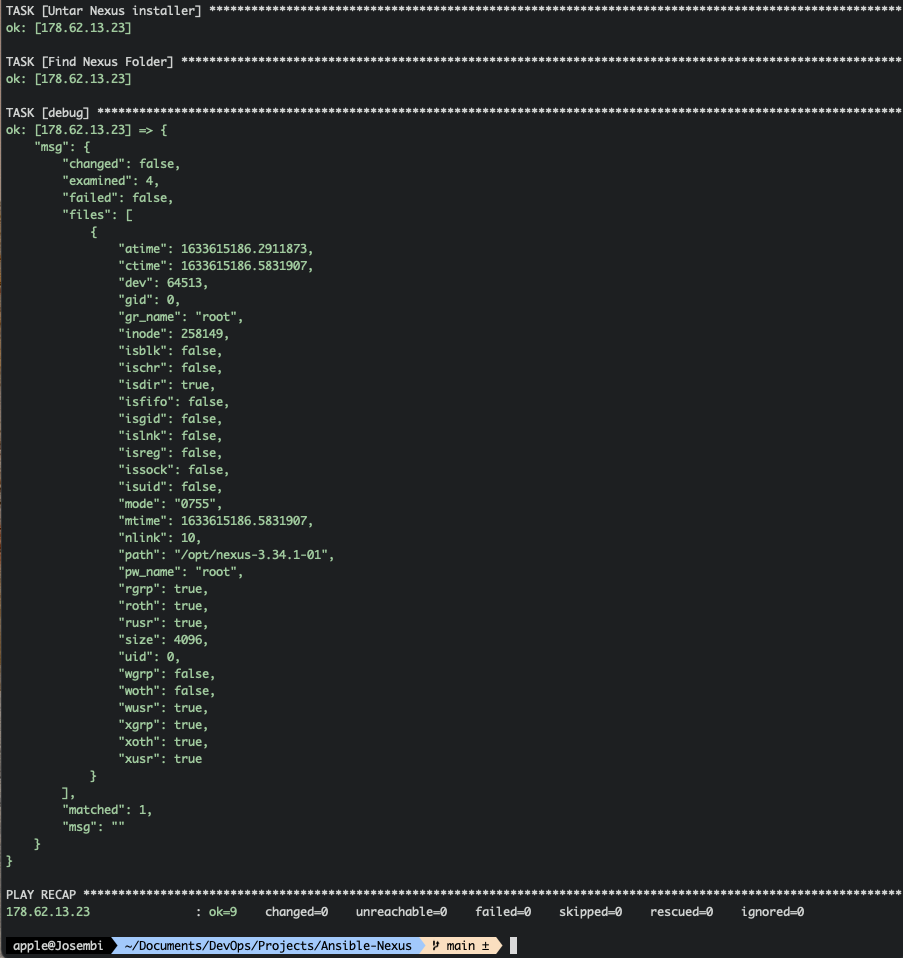

Un-commenting the last two lines in the previous code and re-running the playbook will rename the folder to nexus

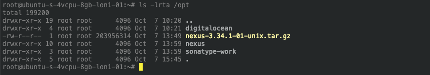

It's possible to configure the playbook in a way that instead of throwing an error whilst copying to an already existing folder with files, it would actually skip it. I'm adding the modules I've changed instead of pasting the whole playbook.

```yaml
    - name: Check if folder already exists
      stat:
        path: /opt/nexus
      register: stat_result
    - name: Rename nexus folder
      shell: mv {{find_result.files[0].path}} /opt/nexus
      when: not stat_result.stat.exists
```

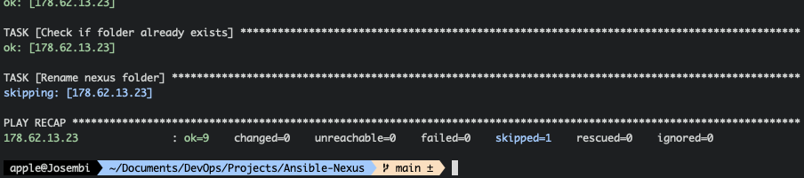

## Create Nexus User

Since **sonatype-work** and **nexus** are owned by root, I'll create a nexus user, add the user to a group and create ownership of those two folders to the user. Here go the play.
The first part of the play (*Create nexus user to own nexus folders*) is equivalent to the linux command;

```shell
chown -R nexus:nexus nexus-3.28.1-01
```

The second part of the play (*Make nexus user owner of nexus folder*) is equivalent to;

```shell
chown -R nexus:nexus sonatype-work
```

```yaml
- name: Create nexus user to own nexus folders
  hosts: 178.62.13.23
  tasks:
    - name: Ensure group nexus exists
      group:
        name: nexus
        state: present
    - name: Create nexus user
      user:
        name: nexus
        group: nexus
    - name:  Make nexus user owner of nexus folder
      file:
        path: /opt/nexus
        state: directory
        owner: nexus
        group: nexus
        recurse: yes
    - name: Make nexus user owner of sonatype-work folder
      file:
        path: /opt/sonatype-work
        state: directory
        owner: nexus
        group: nexus
        recurse: yes
```

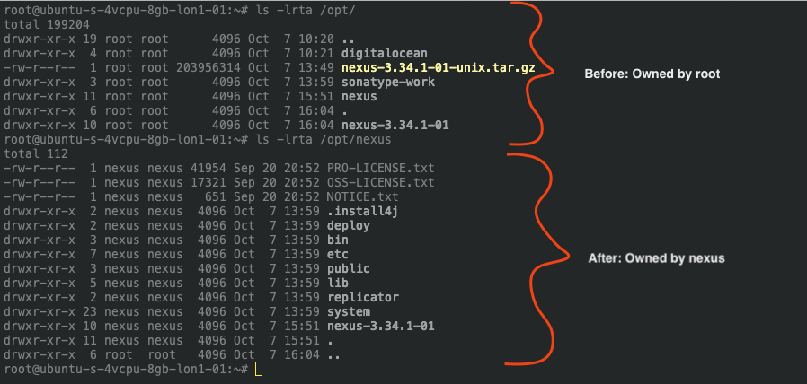

## Starting Nexus with Nexus User

Normally in order to allow the created **nexus** user to start nexus, we usually edit the **nexus.rc** file as follows;

```shell
vim nexus-3.28.1-01/bin/nexus.rc
run_as_user="nexus"
```

With ansible, I'll create another playbook as follows to add the line **run_as_user="nexus"** in the empty file;

```yaml
- name: Start nexus with nexus user
  hosts: 178.62.13.23
  become: True
  become_user: nexus
  tasks:
    - name: Set run_as_user nexus
      lineinfile:
        path: /opt/nexus/bin/nexus.rc
        regex: '^#run_as_user=""'
        line: run_as_user="nexus"
    - name: Start nexus
      command: /opt/nexus/bin/nexus start
```

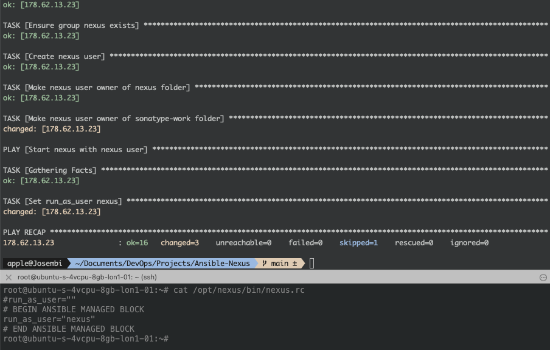

Server started successfully.

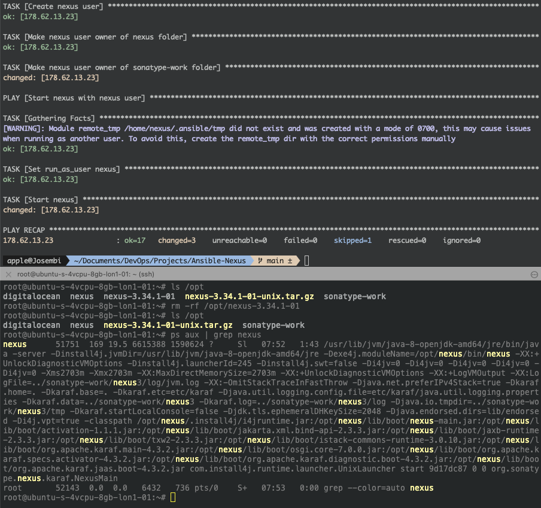

Instead of SSH'ing in the server to check if things are working, we can use our friend the debugger and get an output in the console. Actually, I'll add a play just for that. 

```yaml
- name: Debugger for verification
  hosts: 178.62.13.23
  tasks:
    - name: Check with ps
      shell: ps aux | grep nexus
      register: app_status
    - debug: msg={{app_status.stdout_lines}}
    - name: Check with netstat
      shell: netstat -plnt
      register: app_status
    - debug: msg={{app_status.stdout_lines}}
```

After running the playbook, we can see nexus process is running (ps 55461) and below there is java listening at port 35805. We don't see the port (8081) where nexus is running though because it takes a while for the mapping to be complete or you can configure the play with a *wait condition* module called **wait_for** or **pause** to avoid that. If I run netstat on the server it will actually show it.

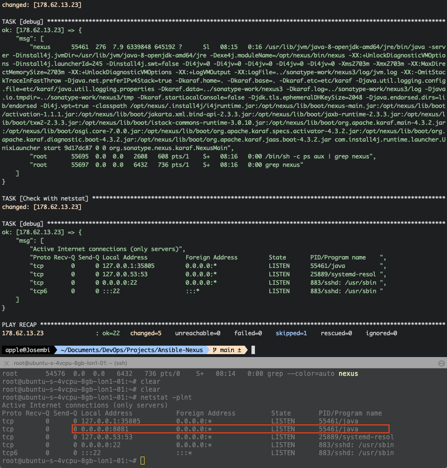

</hr>

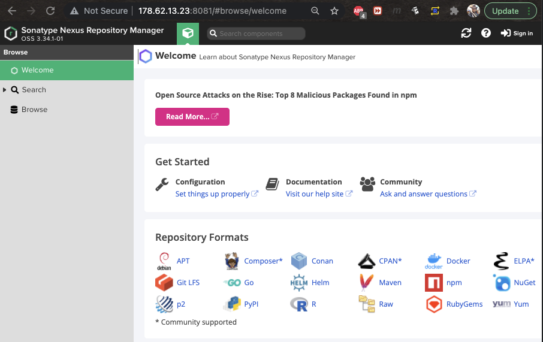


Pause condition can be implemented as below;

```yaml
- name: Debugger for verification
  hosts: 178.62.13.23
  tasks:
    - name: Check with ps
      shell: ps aux | grep nexus
      register: app_status
    - debug: msg={{app_status.stdout_lines}}
    - name: Wait one minute
      pause: 
        minutes: 1
    - name: Check with netstat
      shell: netstat -plnt
      register: app_status
    - debug: msg={{app_status.stdout_lines}}
```

